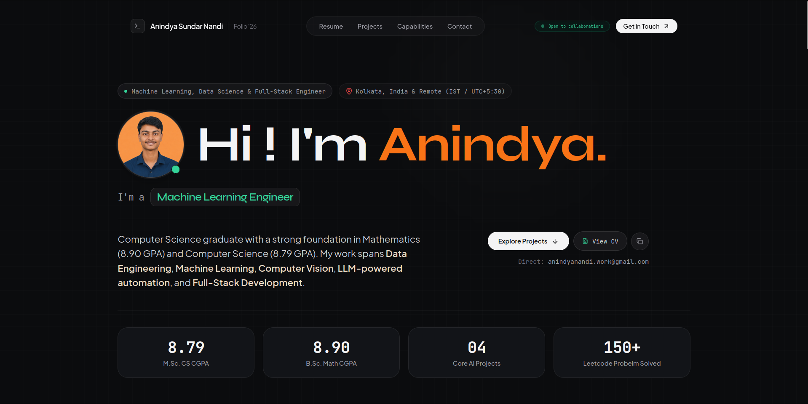

# Anindya Sundar Nandi — Portfolio

<p align="center">
  <strong>Machine Learning &bull; Data Science &bull; Full-Stack Systems</strong>
</p>

<p align="center">
  <a href="https://anindyasnandi.vercel.app/">
    
  </a>
  <a href="https://github.com/Anindya4">
    
  </a>
  <a href="https://www.linkedin.com/in/anindyasnandi/">
    
  </a>
</p>

<p align="center">
  <a href="https://anindyasnandi.vercel.app/">
    
  </a>
</p>

---

## Overview

A modern, high-performance developer portfolio showcasing engineering projects across **Machine Learning**, **Computer Vision**, **Data Engineering**, and **Full-Stack Systems**. 

Designed with an editorial, minimalist aesthetic featuring smooth inertia scrolling, a responsive Bento Grid layout, and an asynchronous, rate-limited backend contact pipeline.

- **Live URL:** [https://anindyasnandi.vercel.app/](https://anindyasnandi.vercel.app/)

---

## Features

- **Editorial Dark UI:** Minimalist palette (`#0b0c0e`) with typography pairing (`Syne`, `Plus Jakarta Sans`, and `JetBrains Mono`).
- **Interactive Bento Grid:** Categorized project highlights (CV/NLP, ML, Data Engineering, and Full Stack) with animated modal deep dives.
- **Inertia Smooth Scroll:** Integrated with `lenis` and custom `framer-motion` reveal sequences.
- **Curated Resume Tracks:** Dual-track downloadable CVs focused on Data Science / ML and Software Engineering (SDE).
- **Secure Contact Service:** Full-stack contact system guarded by Cloudflare Turnstile bot verification, Upstash Redis IP rate limiting, and asynchronous SMTP dispatch via FastAPI.

---

## Tech Stack

### Frontend
- **Framework:** React 18 + Vite
- **Language:** TypeScript
- **Styling:** Tailwind CSS + PostCSS
- **Motion & Interactions:** Framer Motion + Lenis Smooth Scroll
- **Security:** `@marsidev/react-turnstile` (Cloudflare Turnstile)
- **Icons:** Lucide React & React Icons

### Backend
- **Framework:** FastAPI (Python 3.10+)
- **Validation:** Pydantic v2 & `email-validator`
- **Rate Limiting & Cache:** Upstash Redis (REST API)
- **Email Delivery:** Asynchronous SMTP with SSL/TLS

### Deployment & Infrastructure
- **Platform:** Vercel (Monorepo hosting Vite SPA + FastAPI serverless functions)

---

## Project Structure

```bash
portfolio/
├── backend/                  # FastAPI backend service
│   ├── server.py             # App entrypoint, rate limiter & contact handler
│   └── requirements.txt      # Python dependencies
├── public/                   # Static assets & documents
│   ├── cv/                   # Downloadable CV PDFs
│   └── img/                  # Visual assets & hero screenshot
│       └── hero.png          # Main portfolio showcase image
├── src/
│   ├── components/           # React components (BentoGrid, Hero, Contact, etc.)
│   ├── data/                 # Portfolio content & project schemas
│   ├── icons/                # Custom SVGs & badges
│   ├── App.tsx               # Main application container
│   ├── index.css             # Tailwind layers & typography setup
│   └── main.tsx              # React DOM mounting
├── package.json              # Frontend dependencies and scripts
├── tailwind.config.js        # Tailwind theme configuration
├── vercel.json               # Vercel routing (frontend + serverless backend)
└── vite.config.ts            # Vite bundler config
```

---

## Getting Started

### 1. Clone the repository

```bash
git clone https://github.com/Anindya4/portfolio.git
cd portfolio
```

### 2. Frontend Setup

Install dependencies:
```bash
npm install
```

Start the Vite development server:
```bash
npm run dev
```

The frontend will run at `http://localhost:5173`.

### 3. Backend Setup (Optional, for Contact API)

Navigate to the backend and create a virtual environment:
```bash
python3 -m venv .venv
source .venv/bin/activate
pip install -r backend/requirements.txt
```

Run the FastAPI server:
```bash
uvicorn backend.server:app --reload --port 8000
```

---

## Environment Variables

Create a `.env` file in the root directory:

```env
# Frontend
VITE_API_URL=http://localhost:8000
VITE_TURNSTILE_SITEKEY=your_cloudflare_turnstile_site_key

# Backend (Contact Service)
FRONTEND_ORIGIN=http://localhost:5173,https://anindyasnandi.vercel.app
TURNSTILE_SECRET_KEY=your_cloudflare_turnstile_secret_key
KV_REST_API_URL=your_upstash_redis_rest_url
KV_REST_API_TOKEN=your_upstash_redis_rest_token
GMAIL_ADDRESS=your_email@gmail.com
GMAIL_APP_PASSWORD=your_gmail_app_password
CONTACT_RECIPIENT=your_inbox@gmail.com
```

---

## Author

**Anindya Sundar Nandi**

- Website: [anindyasnandi.vercel.app](https://anindyasnandi.vercel.app/)
- GitHub: [@Anindya4](https://github.com/Anindya4)
- LinkedIn: [in/anindyasnandi](https://www.linkedin.com/in/anindyasnandi/)
- Email: [anindyanandi.work@gmail.com](mailto:anindyanandi.work@gmail.com)

---

## License

This project is open source and available under the [MIT License](LICENSE).